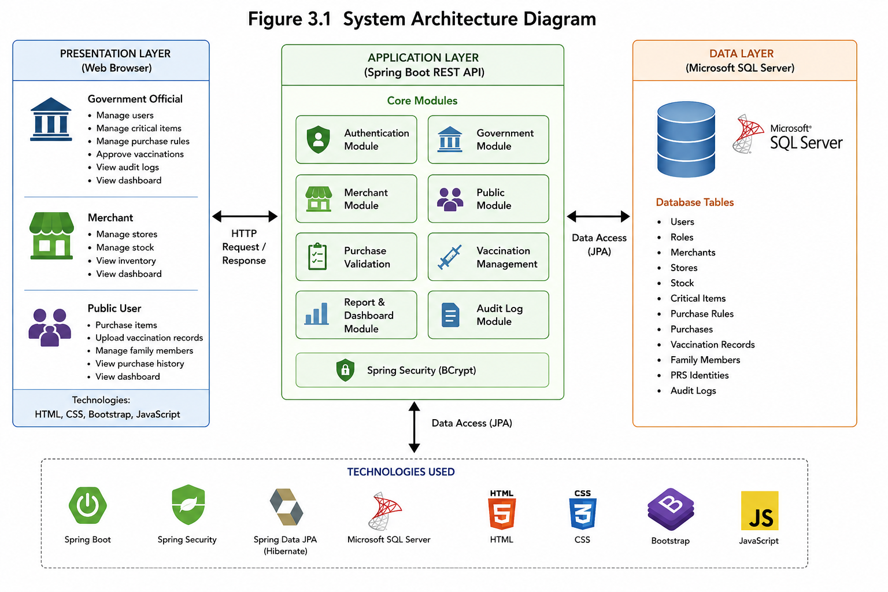
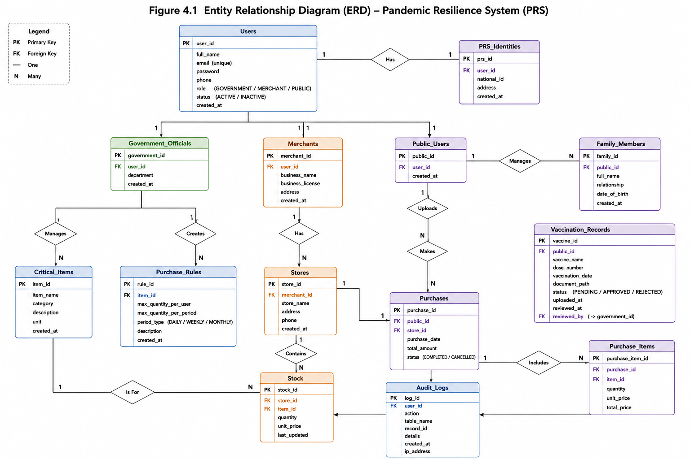

# 🛡️ Pandemic Resilience System (PRS)

A full-stack web application designed to support governments, merchants, and citizens during public health emergencies by managing critical resources, inventory, purchase regulations, and vaccination records.

---

## 📌 Project Overview

The Pandemic Resilience System (PRS) was developed as a Database Fundamentals course design project at **Shenyang University of Technology**.

The system enables:

- Government officials to manage critical resources and purchase rules.
- Merchants to manage stores and inventory.
- Citizens to purchase regulated items and manage vaccination records.

The project follows a three-tier architecture using Spring Boot and Microsoft SQL Server.

---

## ✨ Features

### 🔐 Authentication

- User Registration
- User Login
- BCrypt Password Hashing
- Role-based Access

---

### 🏛 Government Dashboard

- Manage Users
- Manage Critical Items
- Create Purchase Rules
- Edit Purchase Rules
- Delete Purchase Rules
- Approve Vaccinations
- View Audit Logs
- Dashboard Statistics

---

### 🏪 Merchant Dashboard

- Create Merchant Profile
- Register Stores
- Delete Stores
- Add Stock
- Update Existing Stock Quantity
- View Inventory

---

### 👤 Public Dashboard

- Create PRS Identity
- Add Family Members
- Delete Family Members
- Purchase Critical Items
- View Purchase History
- Upload Vaccination Records

---

## 🛠 Tech Stack

| Technology | Description |
|------------|-------------|
| Java 17 | Programming Language |
| Spring Boot | Backend Framework |
| Spring Data JPA | ORM |
| Spring Security | Password Encryption |
| SQL Server | Database |
| Bootstrap 5 | Frontend UI |
| HTML5 | User Interface |
| CSS3 | Styling |
| JavaScript | Frontend Logic |
| Maven | Dependency Management |

---

## 🏗 System Architecture



---

## 🗄 Database Design



---

## 📸 Screenshots

### Landing Page

(Add Screenshot)

### Login

(Add Screenshot)

### Government Dashboard

(Add Screenshot)

### Merchant Dashboard

(Add Screenshot)

### Public Dashboard

(Add Screenshot)

---

## 🚀 Installation

Clone the repository.

```bash
git clone https://github.com/Dubow/Pandemic-Resilience-System.git
```

Enter the project directory.

```bash
cd Pandemic-Resilience-System
```

Configure SQL Server in:

```
src/main/resources/application.properties
```

Run the SQL script to create the database.

Start the Spring Boot application.

Open:

```
http://localhost:8081
```

---

## 📂 Project Structure

```text
Pandemic-Resilience-System/
│
├── .mvn/
│   └── wrapper/
│
├── src/
│   ├── main/
│   │   ├── java/
│   │   │   └── com/
│   │   │       └── prs/
│   │   │           └── backend/
│   │   │               ├── config/
│   │   │               │   └── SecurityConfig.java
│   │   │               │
│   │   │               ├── controller/
│   │   │               │   ├── AuthController.java
│   │   │               │   ├── GovernmentController.java
│   │   │               │   ├── MerchantController.java
│   │   │               │   └── PublicController.java
│   │   │               │
│   │   │               ├── dto/
│   │   │               │   ├── LoginRequest.java
│   │   │               │   ├── RegisterRequest.java
│   │   │               │   └── ...
│   │   │               │
│   │   │               ├── entity/
│   │   │               │   ├── User.java
│   │   │               │   ├── Merchant.java
│   │   │               │   ├── Store.java
│   │   │               │   ├── CriticalItem.java
│   │   │               │   ├── Stock.java
│   │   │               │   ├── Purchase.java
│   │   │               │   ├── PurchaseRule.java
│   │   │               │   ├── VaccinationRecord.java
│   │   │               │   ├── FamilyMember.java
│   │   │               │   ├── PRSIdentity.java
│   │   │               │   └── AuditLog.java
│   │   │               │
│   │   │               ├── repository/
│   │   │               │   ├── UserRepository.java
│   │   │               │   ├── MerchantRepository.java
│   │   │               │   ├── StoreRepository.java
│   │   │               │   ├── StockRepository.java
│   │   │               │   ├── PurchaseRepository.java
│   │   │               │   ├── PurchaseRuleRepository.java
│   │   │               │   ├── VaccinationRepository.java
│   │   │               │   ├── FamilyMemberRepository.java
│   │   │               │   ├── PRSIdentityRepository.java
│   │   │               │   └── AuditLogRepository.java
│   │   │               │
│   │   │               ├── service/
│   │   │               │   ├── AuthService.java
│   │   │               │   ├── GovernmentService.java
│   │   │               │   ├── MerchantService.java
│   │   │               │   └── PublicService.java
│   │   │               │
│   │   │               ├── view/
│   │   │               │   └── HomeController.java
│   │   │               │
│   │   │               └── PrsBackendApplication.java
│   │   │
│   │   └── resources/
│   │       ├── static/
│   │       │   ├── css/
│   │       │   ├── js/
│   │       │   └── images/
│   │       │
│   │       ├── templates/
│   │       │   ├── index.html
│   │       │   ├── login.html
│   │       │   ├── register.html
│   │       │   ├── government-dashboard.html
│   │       │   ├── merchant-dashboard.html
│   │       │   └── public-dashboard.html
│   │       │
│   │       └── application.properties
│   │
│   └── test/
│
├── .gitattributes
├── .gitignore
├── mvnw
├── mvnw.cmd
├── pom.xml
└── README.md
```

---

## 🔐 Security

The application uses Spring Security's BCrypt Password Encoder to securely hash user passwords before storing them in the database.

---

## 🔮 Future Improvements

- JWT Authentication
- Email Verification
- QR Code PRS Identity
- Mobile Application
- Online Payment Integration
- Notification System

---

## 👨‍💻 Author

**Abdirahman Dubow Mohamed**

GitHub: https://github.com/Dubow
